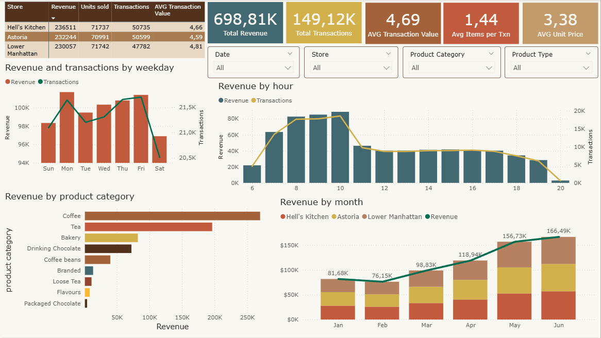
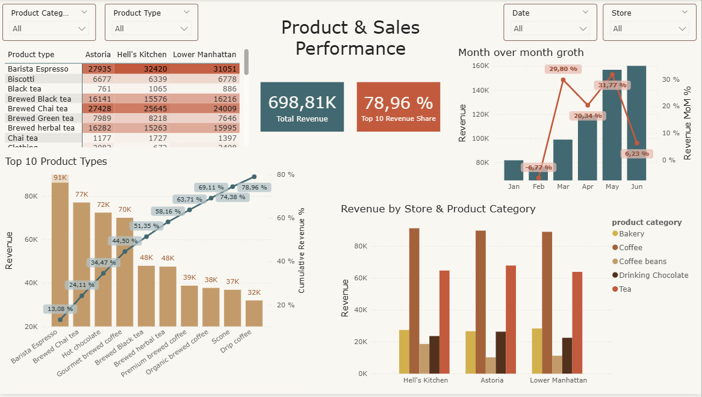

# Coffee Shop Sales Analysis

## Project Overview

This project analyzes sales data from Maven Roasters, a fictional coffee shop chain operating across three locations in New York City.

The goal of the project is to analyze sales performance, identify key revenue drivers, understand customer purchasing patterns, and build an interactive Power BI report for business reporting.

The project covers the full analytical workflow:

- Data quality assessment and preparation
- SQL-based data analysis
- Exploratory Data Analysis in Python
- DAX calculations and interactive Power BI dashboards
- Business insights and recommendations


## Tech Stack

- PostgreSQL
- SQL
- Python (Pandas, NumPy)
- Power BI
- DAX
- Git & GitHub


## Dashboard Preview

### Sales Overview


### Product & Sales Performance



## Business Context

Maven Roasters operates three coffee shop locations:

- Astoria
- Hell's Kitchen
- Lower Manhattan

The dataset contains transaction-level sales data for January–June 2023.

The analysis focuses on several business areas:

- Overall sales performance
- Sales trends over time
- Store performance
- Product and category performance
- Sales patterns by hour and weekday
- Transaction characteristics
- Product contribution to total revenue


## Business Questions

The analysis aims to answer the following questions:

### Sales Performance
- How much revenue was generated during the analyzed period?
- How many transactions and items were sold?
- What is the average transaction value?
- How does sales performance change over time?

### Store Performance
- Which store generates the highest revenue?
- How does transaction volume differ between stores?
- How does product category performance vary across locations?

### Product Performance
- Which product types generate the most revenue?
- Which product categories contribute most to total revenue?
- How concentrated is revenue among the top-performing products?
- Does the product mix differ between stores?

### Sales Patterns
- What are the busiest hours of the day?
- Which weekdays generate the most revenue and transactions?
- Are there noticeable differences in sales patterns across weekdays and hours?

### Transaction Analysis
- What does the distribution of transaction revenue look like?
- How do average and median transaction revenues compare?
- How does the number of items in a transaction relate to transaction revenue?
- Does average unit price change with transaction quantity?


## Tools & Technologies

- **PostgreSQL** — data validation, transformation and SQL analysis
- **Python** — exploratory data analysis
- **Pandas & NumPy** — data manipulation and analysis
- **Matplotlib** — data visualization
- **Power BI** — interactive dashboards and reporting
- **DAX** — calculated measures and time-based analysis
- **GitHub** — project documentation and version control


## Analysis Workflow

### 1. Data Quality Check
The dataset was checked for:

- Missing values
- Duplicate records
- Unique transaction IDs
- Data types
- Dataset dimensions

No missing values or duplicate rows were identified.

The date and time fields were initially stored as strings and were converted to appropriate datetime formats before further analysis.

### 2. Data Preparation
The following transformations were performed:

- Converted transaction_date to datetime format
- Converted transaction_time to datetime format
- Extracted the transaction hour
- Calculated transaction revenue

Revenue was calculated as:
Revenue = Transaction Quantity × Unit Price

The transformed data was validated and confirmed to be ready for analysis.


## SQL Analysis

PostgreSQL was used for the main analytical calculations and business-oriented aggregation.

The SQL analysis included:

### KPI Analysis
- Total revenue
- Total transactions
- Average transaction value
- Average unit price

### Time Analysis
- Monthly revenue
- Revenue and transactions by weekday
- Revenue and transactions by hour
- Hour × weekday analysis

### Store Analysis
- Revenue by store
- Transactions by store
- Average transaction value by store

### Product Analysis
- Revenue by product category
- Revenue by product type
- Product type contribution to total revenue
- Cumulative revenue by product type
- Product performance by store
- Product category performance by store


## Exploratory Data Analysis with Python

Python was used to perform exploratory analysis that complements the SQL analysis rather than duplicating it.

The EDA focuses mainly on transaction-level patterns and data distributions.

### Transaction Revenue
The distribution of transaction revenue was analyzed using:

- Mean
- Median
- Quartiles
- Distribution shape
- Outlier analysis

The analysis showed a right-skewed distribution of transaction revenue, indicating that a relatively small number of higher-value transactions increase the average transaction value.

### Transaction Quantity
The distribution of items sold per transaction was analyzed to understand typical transaction size.

### Quantity vs Revenue
The relationship between transaction quantity and transaction revenue was examined.

As expected, transactions containing more items generally generate higher revenue. This relationship should be interpreted carefully because transaction revenue is calculated using transaction quantity and unit price.

### Unit Price vs Transaction Quantity
Average unit price was also analyzed across different transaction quantities.

Higher-quantity transactions tend to have lower average unit prices, which may indicate differences in product mix rather than discounts, since discount information is not available in the dataset.


## Power BI Dashboard

The Power BI report transforms the analytical results into an interactive business reporting layer.

### Dashboard 1 — Sales Overview

The Sales Overview dashboard provides a high-level view of business performance.

### Key metrics
- Total Revenue
- Total Transactions
- Average Transaction Value
- Average Items per Transaction
- Average Unit Price

### Visual analysis
- Revenue by month
- Revenue by store
- Revenue by weekday
- Revenue by hour
- Revenue by product category
- Transaction-level revenue distribution

Interactive filters allow users to explore the results by:
- Date
- Store
- Product Category
- Product Type

### Dashboard 2 — Product & Sales Performance

The second dashboard focuses on product performance and revenue concentration.

It includes:
- Top 10 Product Types by Revenue
- Revenue contribution by product type
- Cumulative Revenue %
- Revenue by Store & Product Category
- Monthly Revenue MoM %
- Product and store filters

### DAX Measures
DAX was used for dynamic business metrics, including:
- Total Transactions
- Average Transaction Value
- Average Items per Transaction
- Revenue Contribution %
- Revenue MoM %
- Product Ranking
- Cumulative Revenue %


## Key Findings

### Overall Performance

The analyzed period generated approximately $698.8K in revenue from 149K transactions.

The average transaction value was approximately $4.69, while the average number of items per transaction was approximately 1.44.

### Store Performance

Hell's Kitchen generated the highest revenue among the three locations, followed by Astoria and Lower Manhattan.

However, the differences between stores are relatively moderate, suggesting broadly similar overall sales performance across locations.

### Product Performance

Coffee is the largest revenue-generating product category, accounting for approximately 38.6% of total revenue.

Coffee and Tea together account for approximately 66.7% of total revenue, making them the dominant product categories.

### Product Concentration

The largest product types account for a substantial share of total revenue.

The top 10 product types generate approximately 79% of total revenue, indicating a relatively concentrated product revenue structure.

### Sales by Hour

Sales peak during the morning, with 10:00 AM generating the highest hourly revenue.

Revenue and transaction volume decline substantially after the morning peak.

The average transaction value remains relatively stable across most hours, suggesting that differences in hourly revenue are primarily driven by transaction volume rather than large differences in transaction value.

### Weekly Sales Pattern

Friday generates the highest number of transactions, while Monday generates the highest total revenue.

Weekend sales are lower than weekday sales, with Saturday and Sunday showing the lowest overall transaction volumes.

### Transaction Revenue Distribution

Transaction revenue is right-skewed, with the mean exceeding the median.

This indicates that most transactions are relatively small, while a smaller number of high-value transactions increase the overall average.


## Business Recommendations

Based on the analysis, several areas could be considered for further investigation:

Focus staffing and operational capacity around peak morning hours.
Maintain strong availability of Coffee and Tea products, which generate the majority of revenue.
Investigate the product mix of high-quantity transactions to understand why their average unit price tends to be lower.
Analyze opportunities to increase average transaction value through product bundling or cross-selling.
Monitor the performance of high-contribution product types across individual stores.


## Project Structure

```text
coffee-sales-analysis/
│
├── data/
│   └── coffee_sales.csv
│
├── power_bi/
│   ├── coffee_sales_dashboard.pbix
│   └── screenshots/
│       ├── sales_overview.png
│       └── product_performance.png
│
├── python/
│   └── coffee_sales_eda.ipynb
│
├── sql/
│   └── coffee_sales_analysis.sql
│
├── README.md
```
## Conclusion

This project demonstrates an end-to-end data analytics workflow, from raw transactional data to business-oriented reporting.

SQL was used for structured data analysis and aggregation, Python was used for exploratory analysis and identifying transaction-level patterns, and Power BI was used to transform the results into interactive dashboards.

The analysis highlights the importance of combining different analytical tools rather than using a single tool for the entire workflow.


## Contact & Connect

GitHub: https://github.com/Sobkalova-Iryna

LinkedIn: www.linkedin.com/in/iryna-sobkalova-55ab83342

Email: sobkalova.irina.111@gmail.com